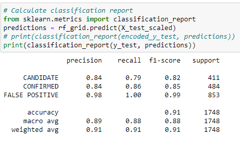

# Exoplanet-Exploration


## Table of Contents

- [Table of Contents](#table-of-contents)
- [Introduction](#Introduction)
- [Structure](#Structure)
- [Setup](#Setup)
- [Analysis](#Analysis)
- [Contributors](#Contributors)
- [Technology](#Technology)

## Introduction

The NASA Kepler space telescope has been out on a planet-hunting mission to discover hidden planets
outside of our solar system. This data collected for over nine years of period is being used to process and
predict scores. 

In this project, the goal is to find an optimized machine learning model to discover hidden planets outside of our solar system using Exoplanet Exploration dataset.

## Structure
```
 
Exoplanet-Exploration
|
|__data/                                    # Directory for the data files
|     |__ exoplanet_data.csv
|
|__ images/
|     |__ exoplanets.jpg
|     |__ pythonlogo.png
|     |__ RandomForestClasificationReport.png
|
|__ LogesticRegression_model.ipynb          # LR model notebook file
|__ RandomForest_model.ipynb                # RF model notebook file
|__ knn_model.ipynb                         # KNN model notebook file
|__ svc_model.ipynb                         # SVM model notebook file
|__ tree_model.ipynb                        # TREE model notebook file
|__ gitignore file
|__ README.md                               # read me file
|__ helen.sav                               # The best (RF_Grid model)Saved 
                   

```

## Setup

Initially, the raw dataset was preprocessed and removed unnecessary columns and dropped null value
rows. Then the data was scaled using MinMaxScaler followed by splitting the data into test and train
data to create a machine learning model. 

The models created are Logistic Regression, K-Nearest Neighbours, Support Vector Machine, Decision Tree Classifier and Random Forest Classifier. The use of GridSearch improved the accuracy of all model.

The best optimized model has been saved as "Helen.sav" file

## Analysis

### Comparison
After comparing all the models, it looks like Random Forest Classifier gives the best Accuracy Score.

| Model | Logistic Regression optimized by GridSearch | Decision Tree optimized by GridSearch | Random Forest optimized by GridSearch | K-Nearest Neighbours optimized by GridSearch | SVM optimized by GridSearch |
|-|-|-|-|-|-|
| Training Data Score | 0.825 | 0.890 | 1.0 | 0.822 | 0.824 |
| Testing Data Score | 0.810 | 0.882 | 0.909 | 0.798 | 0.805 |

### Random Forest Clasification Report (optimized by GridSearch)
In Exoplanet-Exploration senario, the percision is more important than the recall and looking at the report below, the precision rate(0.84) is greater than recall rate (0.79 ).




## Contributors

- [Helen Amin](https://github.com/helenamin)

## Technology

- 
